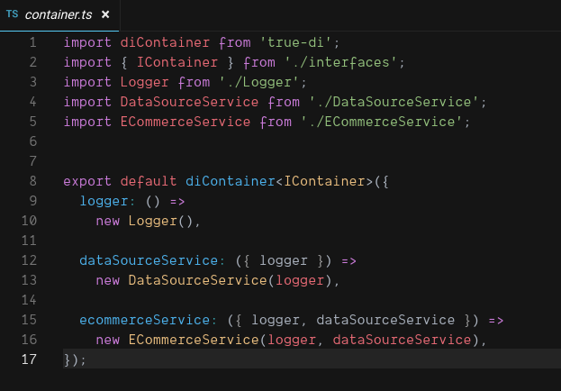

# true-di

`true-di` is a Simple Dependency Injection Container for TypeScript and JavaScript

[](https://travis-ci.org/DScheglov/true-di) [](https://coveralls.io/github/DScheglov/true-di?branch=master) [](https://www.npmjs.com/package/true-di) [](https://www.npmjs.com/package/true-di) [](https://github.com/DScheglov/true-di/blob/master/LICENSE)

## Installation

```bash
npm i --S true-di
```

```bash
yarn add true-di
```

## Documentation

[Read Documentation on Git Book](https://dscheglov.gitbook.io/true-di/)

## Usage Example:

**./src/container.ts**

```typescript
import diContainer from 'true-di';
import { IContainer } from './interfaces';
import Logger from './Logger';
import DataSourceService from './DataSourceService';
import ECommerceService from './ECommerceService';


const container = diContainer<IContainer>({
  logger: () =>
    new Logger(),

  dataSourceService: ({ logger }) => 
    new DataSourceService(logger),

  ecommerceService: ({ logger, dataSourceService }) =>
    new ECommerceService(logger, dataSourceService),
});

export default container;
```

**./src/controller.ts**

```typescript
import Express from 'express';

export const getOrders = async (req: Express.Request, res: Express.Response) => {
  const { ecommerceService } = req.container;
  res.json(
    await ecommerceService.getOrders()
  );
}
```

**./src/index.ts**

```typescript
import express from 'express';
import container from './container';
import { getOrders } from './controller';

const app = express();

app.use((req, res, next) => {
  req.container = container;
  next();
});

app.get('/orders', getOrders);
app.listen(8080);
```

### [Live Demo on Sandbox](https://codesandbox.io/s/github/DScheglov/true-di/tree/examples/getting-started?fontsize=14&hidenavigation=1&initialpath=%2Forders&module=%2Fsrc%2Fcontainer.ts&theme=dark)



## Why `true-di`?

1. It's light and idiomatic.
1. It works with **JavaScript** and **TypeScript**.
1. It's well-typed. Items types are always known whenever your code assess them.
1. It is Isomorphic: works on Back end and on Front end.
1. It works with Classes and with Closures.
1. It doesn't require decorators (annotations).
1. It doesn't depend on `reflect-metadata`.
1. It allows referring items without strings or other artificial elements.
1. It uses `getters` under the hood.
1. It's lazy: container doesn't create an item until your code requests
1. It automatically resolves dependencies
1. It immediately falls down on constructor-injection of cyclic dependency
1. It supports property-, setter- cyclic dependencies
1. It doesn't know anything about context but it could be easily placed into the context.
1. Its containers are composable.
1. It's SOLID-compatible.
1. It's more SOLID-compatible then other IOC solutions. Your code doesn't need to depend on the container (nor even on its interface).
1. It's testable.
1. It supports symbolic names.
1. It doesn't have any other dependencies (and it will be kept)
